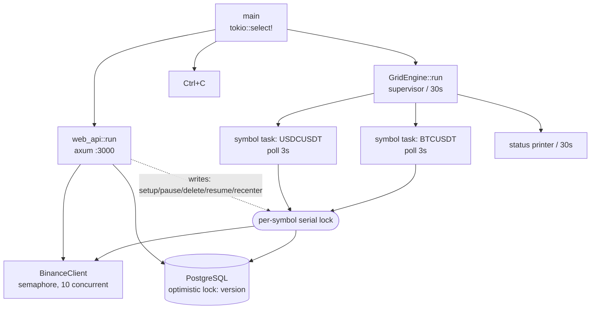
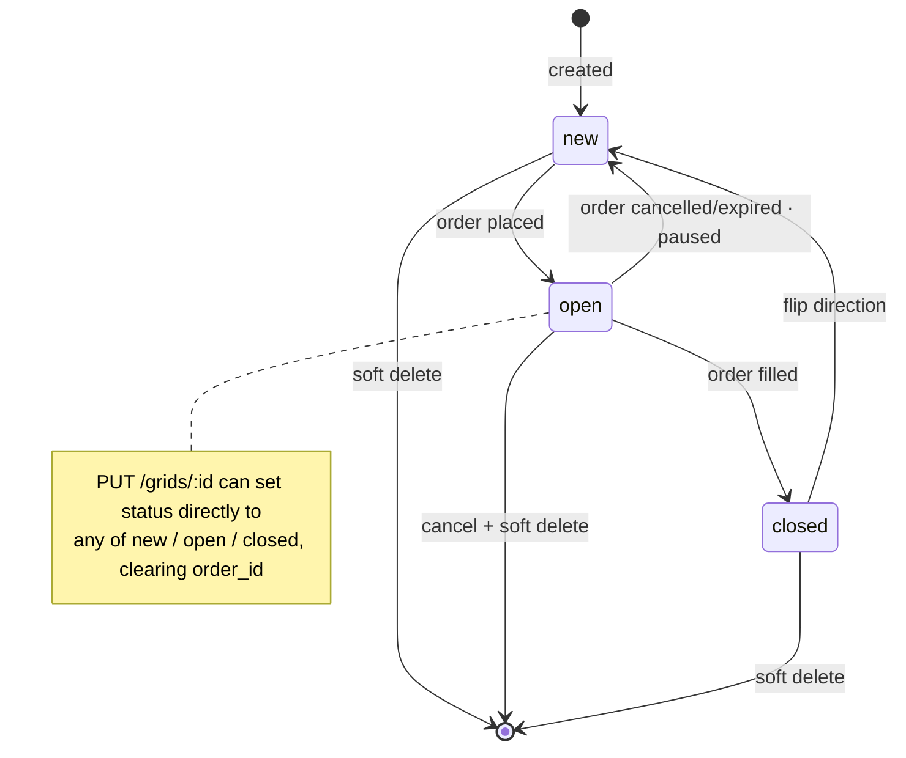

# rungs

[](LICENSE)
[](https://www.rust-lang.org/)
[](https://www.postgresql.org/)

**A Binance spot grid trading bot — for technical research and educational purposes only.** Rust backend, Vue 3 frontend, compiled into a single binary that serves the frontend assets itself — deployment needs nothing beyond nginx.

> **Read the [Disclaimer](#disclaimer) in full before using this.** This program places real orders with real money on a real exchange and can lose you your entire principal.

English | [简体中文](README.md)

---

# Disclaimer

> ⚠️ **This project exists for technical research and educational exchange only.**

## This Is Not a Financial Product

rungs is an open-source implementation for studying *how a grid strategy is engineered into a real service*. What it demonstrates is **engineering problems** — state machines, concurrency consistency, exchange API constraint handling — not a validated profitable strategy.

The author has only run a small-scale trial on **one stablecoin pair, USDC/USD**, which recorded roughly **0.04% daily return** (about 15% annualized, simple interest). Please read that number correctly:

- **It comes from a stablecoin pair and does not extrapolate to any other market.** USDC/USD is pegged near 1, with minimal volatility and extremely tight rung spacing — a fundamentally different regime from a volatile pair like BTCUSDT, for which this figure tells you nothing.
- It is **a single observation from one account, one trading pair, a limited time window, and one particular market regime**. It is not a backtest and carries no statistical significance.
- "15% annualized" is a **linear extrapolation** from a short favorable stretch. Grid returns depend heavily on volatility and on price staying inside the range — outside that sample, the extrapolation simply stops holding.

**Past performance does not indicate future results. Nothing in this project constitutes investment, financial, or trading advice.**

## What You Can Lose

- **Market risk.** Cryptocurrency prices are highly volatile and **you may lose your entire principal**. Grid strategies profit inside a range; in a sustained downtrend they keep buying an asset that keeps depreciating, and in a sustained uptrend they sell too early and miss the move.
- **Technical risk.** Software defects, network outages, exchange API changes or downtime, server failures, and clock drift can all cause lost orders, duplicate orders, or funds locked up for extended periods. This project **has not undergone any third-party audit**.
- **Automation risk.** The program cancels and places orders unattended. In particular, **automatic re-centering cancels every open order you have on that pair and rebuilds the entire grid at the current price**. Make sure you understand every automatic behavior described in [How It Works](#how-it-works).
- **Security risk.** The Web API holds full authority to place orders, cancel orders, and read balances on your exchange account. Misconfiguring it is equivalent to handing your account to the public internet — see [Security Model](#security-model).

## Terms of Use

- This software is provided "**AS IS**", **without warranty of any kind**, express or implied, including but not limited to the warranties of merchantability and fitness for a particular purpose (see [LICENSE](LICENSE)).
- **The authors shall not be liable for any direct, indirect, incidental, or consequential damages** arising from the use of or inability to use this software, including but not limited to loss of funds, loss of data, and loss of profits.
- **This project is not designed for commercial use.** The authors do not recommend it, do not support it, and accept no responsibility for any commercial operation or hosted service built on it. (Legally, the grant of rights is governed solely by [AGPL-3.0](LICENSE), which does not itself prohibit commercial use — this is the authors' stated position, not a license term.)
- By using this software you acknowledge that you have read and understood all of the above and **accept all risks and consequences yourself**.
- Verify for yourself that automated cryptocurrency trading is legal in your jurisdiction.

## If You Run It Anyway

- Give the Binance API key **spot trading permission only, never withdrawals**, and bind an IP allowlist.
- **Only commit funds you can fully afford to lose.** Start with the smallest viable amount and run it long enough to cover at least one regime shift.
- The service binds to `127.0.0.1` by default — **do not expose it directly to the public internet**.
- Periodically reconcile exchange open orders against database records by hand.

---

## Table of Contents

- [Disclaimer](#disclaimer)
- [What This Is](#what-this-is)
- [Features](#features)
- [Architecture](#architecture)
- [How It Works](#how-it-works)
- [Security Model](#security-model)
- [Quick Start](#quick-start-local-development)
- [Production Deployment](#production-deployment-ubuntu)
- [Configuration](#configuration)
- [API Reference](#api-reference)
- [Database](#database)
- [Operations](#operations)
- [Known Limitations](#known-limitations)
- [License](#license)

---

## What This Is

Grid trading is a simple idea: lay out a set of "rungs" across a price range, each with a buy price and a sell price. Buy when the price drops, sell when it rises, and harvest the spread over and over.

rungs turns that into a long-running service:

- The **engine** polls each trading pair (symbol) concurrently, drives a state machine per rung, and handles placing orders, detecting fills, flipping direction, and re-placing the reverse order.
- When **price escapes the grid range**, it follows — first by sliding a single rung, and if that is not possible, by cancelling everything and rebuilding the whole grid.
- A **web UI** for opening positions, monitoring, and checking P&L, plus manual overrides (pause a rung, re-center now).

Single-operator by design: the whole process shares one set of Binance credentials, and the registration endpoint is only open while the database has zero accounts.

**The value of this project is on the engineering side, not the strategy side.** The grid strategy itself is common knowledge; the hard part is turning it into a service that will not quietly ruin your night — what to do when an order is live on the exchange but the database write fails, when two callers place orders simultaneously, when the exchange rate-limits you or your clock drifts. Most of the comments in the code exist to explain decisions of that kind. If you came here for "a bot that makes money", read the [Disclaimer](#disclaimer) first.

## Features

| | |
|---|---|
| **Financial precision** | `rust_decimal` throughout — no `f64` anywhere in price or quantity math |
| **Auto position setup** | Supply only symbol, rung count, and spacing; everything else is derived from account balances |
| **Follows the market** | After price sits outside the range for 5 minutes, slide the window by one rung; full rebuild when no rung can be moved |
| **Stable anchor** | Rebuilds anchor on the **median** close of the last 24 hourly candles, not the spot price |
| **Exchange-filter aware** | Fetches and caches `stepSize` / `tickSize` / `minQty` / `minNotional`, and rounds before submitting |
| **Idempotent orders** | `clientOrderId = g{gridId}v{version}` — a retry after a timeout cannot produce a second real order |
| **Concurrency-safe** | Database optimistic locking plus a per-symbol serial lock; two independent guards against duplicate orders |
| **No orphan orders** | If an order is accepted but the database write fails, it is cancelled immediately; if the cancel also fails, the `order_id` is logged at error level |
| **Rate-limit self-throttling** | On 429/418 the client enters its own wait window instead of escalating into an IP ban |
| **Clock self-correction** | On a `-1021` timestamp error, syncs with exchange time and retries |
| **Single-binary deploy** | The frontend bundle is served by axum, with SPA fallback |

## Architecture

### Workspace Layout

```
crates/
├── app/            # Binary entrypoint; runs the engine and Web API concurrently
├── config/         # Configuration loading (dotenvy + envy)
├── binance-client/ # Binance spot REST API: HMAC-SHA256 signing, self-throttling, clock sync
├── db/             # sqlx data access layer (PostgreSQL)
├── grid-engine/    # Grid trading engine + pure strategy functions
└── web-api/        # axum HTTP API + static file hosting
frontend/           # Vue 3 admin UI, built into public/dist/
migrations/         # Database migrations, applied in filename order
```

### Runtime Topology



The supervisor reconciles every 30 seconds: it spawns a task for each newly active symbol, stops tasks for symbols with no remaining rungs, and restarts any task that died. A database hiccup does not kill the engine — on a failed query it keeps the previous symbol set and retries later.

## How It Works

### The Rung State Machine

Each rung (one `user_grid` row) moves between four states:



- **new** — no order yet. A buy rung places a limit buy at `buy_price`; a sell rung places a limit sell at `sell_price`.
- **open** — the order is live on the exchange. Each round fetches `openOrders` once; if the order is gone, it is queried individually to distinguish `FILLED` from `CANCELED/EXPIRED`.
- **closed** — filled. The rung flips direction immediately — a filled buy becomes a sell rung and vice versa — and the reverse order goes out **within the same round**, without waiting for the next poll.

**The amount unit is converted on flip**, and this is where it is easy to get it wrong: a buy rung's `amount` is the quote currency to spend, while a sell rung's `amount` is the base currency quantity to sell. After a buy fills you actually hold `round_quantity(amount / buy_price)` base units, and the sell leg must sell exactly that. Reusing the old `amount` would make the sell leg ask for more base currency than was actually bought — guaranteed `-2010` rejection and a permanently stuck rung.

**Profit is only booked when a sell fills.** Selling is what converts back to quote currency and realizes the spread; a filled buy merely swaps quote for base. The state transition and the profit entry happen in the same database transaction, so "closed but the profit was never recorded" cannot occur.

### Auto Position Setup and Balance Allocation

`POST /api/user/grids/auto-center` takes three parameters:

| Parameter | Example | Description |
|-----------|---------|-------------|
| `symbol` | `USDCUSDT` | Trading pair |
| `grid_count` | `4` | Total number of rungs (1–20) |
| `spacing` | `0.0001` | Price gap between adjacent rungs |

Flow: cancel all open orders on that symbol → wait 2 seconds for funds to return to `free` → read account balances → allocate rungs proportionally → compute the anchor price → soft-delete old rungs → batch-insert new ones.

The allocation algorithm (`allocate_grids`, a pure function with full test coverage):

```
# base and quote are two different currencies — convert to a common unit first
base_value  = base × price
total_value = base_value + quote

sell_grids = round(grid_count × base_value / total_value)
             when both sides hold balance, each direction keeps at least 1 rung

# every sell rung must satisfy both minQty and minNotional; if not,
# reduce the sell rung count so each remaining one gets more
while sell_grids > 0 and (base / sell_grids violates exchange filters):
    sell_grids -= 1

buy_grids   = grid_count − sell_grids
sell_amount = base  / sell_grids     # per sell rung, in base currency
buy_amount  = quote / buy_grids      # per buy rung, in quote currency
```

Two traps the code handles explicitly:

1. **Convert before comparing.** Adding `base + quote` directly would treat 0.5 BTC and 45,000 USDT as "45000.5", driving the BTC-side weight to near zero so sell rungs never get allocated — leaving half the capital idle.
2. **Dust is judged by notional value.** 0.00002 BTC and 5 USDT must both be measured by their USDT value, not by applying one bare number to two different currencies.

### When Price Escapes: Sliding Window and Full Rebuild

Every round checks whether the current price falls within `[min_buy, max_sell]`. Once outside, a timer starts, and an action fires only after the price stays outside for **300 continuous seconds** (`RANGE_DELAY_SECS`, a compile-time constant) — a brief wick will not trigger a rebuild. During the wait a warning is logged every 10 minutes; if the price returns, the timer resets immediately.

**Sliding window** (preferred): move exactly one rung, keeping the total count unchanged.

- Price breaks above the top → remove the unfilled buy rung with the lowest `buy_price`, add a sell rung at the top
- Price breaks below the bottom → remove the unfilled sell rung with the highest `sell_price`, add a buy rung at the bottom

This needs no settlement wait: cancelling a buy releases quote currency while the new sell locks base currency, so the two assets do not conflict.

**Full re-center** (fallback): used when there is no unfilled rung left to remove on the relevant side. Cancel all orders → wait 2 seconds → read `free` balances → re-run the allocation above → rebuild every rung around the new anchor.

The anchor is the **median close of the last 24 hourly candles**, not the current price — spot prices are easily skewed by wicks, medians much less so. If the candle fetch fails, it degrades to the current price rather than aborting the rebuild. Finally `p_floor = ceil(anchor / spacing) × spacing`.

### Concurrency and Consistency

Three layers, because no single one is sufficient:

1. **Database optimistic locking.** `user_grid.version` increments on every state transition, and every write carries `WHERE version = $n`. On conflict the round is skipped, not failed.
2. **Per-symbol serial lock.** `process_symbol` has two concurrent callers — the engine's own polling task, and `resume_grids` over HTTP. Both would read a snapshot with the same version and each place a **real order**; optimistic locking only stops whichever writes to the database second, by which point the order is already live on the exchange. A `tokio::Mutex` guarantees only one round runs per symbol at a time.
3. **Idempotency key.** `clientOrderId = g{grid_id}v{version}`. Binance rejects duplicate keys, so retrying an ambiguous outcome ("request timed out but the order may have landed") cannot create a second order.

**Order/database consistency** is the critical part here. An order takes effect the moment the exchange accepts it, while the database still knows nothing about it. The code guarantees that "the database cannot record this order" implies "cancel it from the exchange right now": on an optimistic-lock conflict, and on a database write failure. If even the cancel fails, the `order_id` is logged at **error level** — that identifier is the only remaining trace of that money and must be reconcilable by hand.

By the same logic, a failed cancel **never proceeds to soft-delete** a row holding an `order_id`; doing so would permanently orphan a live order with funds locked at the exchange. Only `-2011` (order does not exist) and `-2013` (order already terminal) are swallowed as equivalent to a successful cancel.

### Exchange Filters and Rate Limiting

**Order filters.** On first access to a symbol, `exchangeInfo` is fetched once and `stepSize` / `tickSize` / `minQty` / `minNotional` are cached in-process. Quantities round down to `stepSize` — plain `floor()` will not do, since that assumes `stepSize == 1` and would flatten any sub-1-BTC quantity to zero given BTCUSDT's `0.00001` step. Prices round to `tickSize`, and orders below `minNotional` are rejected locally instead of wasting API weight.

**Buy-side balance guard.** Multiple buy rungs in the same round share one quote-currency budget, decremented by the actual spend after each placement. Otherwise every rung would test "is there enough?" against the same initial value, and every check from the second rung onward would be wrong. When a single request exceeds the `free` balance, the amount is automatically reduced to `free × 0.9995` (a 0.05% buffer against timing skew).

**Rate limiting.** Concurrent requests are capped at 10 by a semaphore. On `429`/`418` the client enters a self-throttling window based on `Retry-After`, and all outbound requests wait it out — hammering through it on a 3-second poll loop would only escalate the ban.

**Clock.** Every signed request carries `recvWindow=5000`. More than a second of host clock drift causes the exchange to reject every signed request, and the only symptom is one ordinary warning per rung while trading has actually stopped completely. So a `-1021` triggers an automatic time fetch, offset calculation, and one retry.

## Security Model

**This API holds order placement, cancellation, and balance read authority over your exchange account.** Treat it as a vault door.

| Control | Detail |
|---------|--------|
| **Binds to 127.0.0.1 by default** | Controlled by `BIND_ADDR`. Any other value logs a startup warning. For remote access use nginx + TLS + access control, or an SSH tunnel |
| **One-shot registration** | `POST /api/auth/register` is open only while the `users` table is empty; after the single operator account exists it returns 403 forever. Further accounts require direct database access |
| **Startup invariant check** | The process **refuses to start** if more than one user holds rungs — the engine schedules by symbol, not user_id, so a second account's rungs would spend the operator's funds |
| **Auth endpoint rate limiting** | Per source IP: burst of 5, then roughly one per 12 seconds. Stops password brute-forcing, and stops bcrypt (200–400 ms per call) from saturating the blocking thread pool |
| **Constant-time login** | When the username does not exist, a fixed dummy hash is verified anyway so both paths take the same time — response timing cannot be used to enumerate usernames |
| **JWT secret strength** | `JWT_SECRET` must be ≥ 32 characters, enforced at startup (an HMAC-SHA256 key shorter than the digest weakens the construction). Tokens live 7 days |
| **Password hashing** | bcrypt at `DEFAULT_COST`, executed on the blocking thread pool |
| **Fully parameterized SQL** | sqlx `$1, $2` bindings throughout; no string concatenation |
| **Unauthorized reads as 404** | Someone else's grid id and a nonexistent id return the same status, so existence is not leaked |
| **Secrets never stored or logged** | Binance credentials come from environment variables only; `.env` is gitignored |

**Binance API key permissions: enable spot trading only, never withdrawals.** Binding an IP allowlist is also recommended.

## Quick Start (Local Development)

Prerequisites: Rust 1.88+, Node.js 20+, PostgreSQL 18.

```bash
git clone https://github.com/iciker/rungs.git
cd rungs
cp .env.example .env    # fill in real values — see Configuration
```

**Create the database before compiling.** The backend uses `sqlx::query!` macros, which verify SQL at compile time against a live, migrated database:

```bash
createdb rungs
for f in migrations/*.sql; do psql "$DATABASE_URL" -f "$f"; done
```

Then run it:

```bash
cargo run                     # backend on :3000

cd frontend && npm install    # in a second terminal
npm run dev                   # frontend on :5173, /api proxied to :3000
```

Production shape (frontend bundled and served by Rust, single port):

```bash
cd frontend && npm run build  # outputs to public/dist/
cd .. && cargo run --release  # http://localhost:3000
```

Register the operator account on first visit — that is the only time the registration endpoint will ever be available.

## Production Deployment (Ubuntu)

> For Ubuntu 22.04 / 24.04 LTS.

### 1. System dependencies

```bash
sudo apt update && sudo apt upgrade -y
sudo apt install -y build-essential pkg-config libssl-dev curl git
```

### 2. Rust toolchain

```bash
curl --proto '=https' --tlsv1.2 -sSf https://sh.rustup.rs | sh
source ~/.cargo/env
rustc --version
```

### 3. Node.js 20 (to build the frontend)

```bash
curl -fsSL https://deb.nodesource.com/setup_20.x | sudo -E bash -
sudo apt install -y nodejs
node --version
```

### 4. PostgreSQL 18

```bash
sudo apt install -y postgresql-common
sudo /usr/share/postgresql-common/pgdg/apt.postgresql.org.sh -y
sudo apt install -y postgresql-18
sudo systemctl enable --now postgresql
```

### 5. Database and user

```bash
sudo -u postgres psql <<'EOF'
-- Clean up an old database when redeploying (skip the first three lines on a fresh install)
SELECT pg_terminate_backend(pid) FROM pg_stat_activity WHERE datname = 'rungs';
DROP DATABASE IF EXISTS rungs;
DROP USER IF EXISTS rungs;

CREATE USER rungs WITH PASSWORD 'your_database_password';
CREATE DATABASE rungs OWNER rungs;
GRANT ALL PRIVILEGES ON DATABASE rungs TO rungs;
EOF
```

### 6. Clone and configure

```bash
sudo git clone https://github.com/iciker/rungs.git /opt/rungs
cd /opt/rungs
cp .env.example .env
nano .env
```

Generate a random JWT secret and lock down the file:

```bash
openssl rand -hex 32
chmod 600 .env
```

### 7. Apply migrations

In filename order:

```bash
set -a && source /opt/rungs/.env && set +a
for f in /opt/rungs/migrations/*.sql; do psql "$DATABASE_URL" -f "$f"; done
```

### 8. Build

**Order matters**: the backend connects to the database at compile time to verify SQL, so the migration step above must be done first.

```bash
cd /opt/rungs/frontend && npm install && npm run build   # → /opt/rungs/public/dist/
cd /opt/rungs && cargo build --release                   # → target/release/rungs
```

The first compile takes roughly 5–10 minutes.

### 9. Service account

```bash
sudo useradd --system --no-create-home --shell /bin/false rungs-svc
sudo chown -R rungs-svc:rungs-svc /opt/rungs
sudo chmod 750 /opt/rungs
sudo chmod 600 /opt/rungs/.env
```

### 10. systemd

```bash
sudo nano /etc/systemd/system/rungs.service
```

```ini
[Unit]
Description=rungs — Binance Grid Trading Bot
After=network.target postgresql.service
Requires=postgresql.service

[Service]
Type=simple
User=rungs-svc
Group=rungs-svc
WorkingDirectory=/opt/rungs
EnvironmentFile=/opt/rungs/.env
ExecStart=/opt/rungs/target/release/rungs
Restart=on-failure
RestartSec=10
StandardOutput=journal
StandardError=journal
SyslogIdentifier=rungs

# Hardening
NoNewPrivileges=true
PrivateTmp=true
ProtectSystem=strict
ReadWritePaths=/opt/rungs

[Install]
WantedBy=multi-user.target
```

```bash
sudo systemctl daemon-reload
sudo systemctl enable --now rungs
```

### 11. Verify

```bash
sudo systemctl status rungs
sudo journalctl -u rungs -f     # "配置加载成功" and "数据库连接成功" mean a clean start

curl http://localhost:3000/api/auth/login \
  -H "Content-Type: application/json" \
  -d '{"username":"test","password":"test"}'
# HTTP 401 with {"message":"用户名或密码错误"} means the backend is answering correctly
```

### 12. Firewall

> ⚠️ **Do not expose port 3000 to the internet.** The service binds to `127.0.0.1` by default. Always front it with nginx + TLS + access control, or reach it only over an SSH tunnel.

```bash
sudo ufw allow ssh
sudo ufw allow 443/tcp    # nginx HTTPS only
sudo ufw enable
```

### 13. nginx reverse proxy + HTTPS (optional)

```bash
sudo apt install -y nginx certbot python3-certbot-nginx
sudo nano /etc/nginx/sites-available/rungs
```

```nginx
server {
    listen 80;
    server_name your-domain.com;

    location / {
        proxy_pass http://127.0.0.1:3000;
        proxy_http_version 1.1;
        proxy_set_header Host $host;
        proxy_set_header X-Real-IP $remote_addr;
        proxy_set_header X-Forwarded-For $proxy_add_x_forwarded_for;
        proxy_set_header X-Forwarded-Proto $scheme;
    }
}
```

```bash
sudo ln -s /etc/nginx/sites-available/rungs /etc/nginx/sites-enabled/
sudo nginx -t && sudo systemctl reload nginx
sudo certbot --nginx -d your-domain.com
```

Plain proxying is not enough — nginx is the sole public entrypoint, so add HTTP Basic Auth, client certificates, or an IP allowlist there.

### Updating

```bash
cd /opt/rungs
sudo git pull
cd frontend && npm install && npm run build && cd ..
cargo build --release
sudo systemctl restart rungs
```

## Configuration

Copy `.env.example` to `.env` and fill it in. **Variable names are derived from the `AppConfig` fields in `crates/config`** (envy uppercases them automatically) and cannot be renamed.

| Variable | Required | Default | Description |
|----------|:--------:|---------|-------------|
| `BINANCE_APIKEY` | ✅ | — | Binance API key. Note it is `APIKEY`, not `API_KEY` |
| `BINANCE_SECRET` | ✅ | — | Binance API secret |
| `DATABASE_URL` | ✅ | — | Only `postgres://` or `postgresql://`; driver suffixes like `+asyncpg` are not supported |
| `JWT_SECRET` | ✅ | — | Minimum 32 characters, enforced at startup. Generate with `openssl rand -hex 32` |
| `PORT` | | `3000` | Web API port. The dev proxy in `frontend/vite.config.ts` points here |
| `BIND_ADDR` | | `127.0.0.1` | Listen address. Setting `0.0.0.0` logs a startup warning |
| `RUST_LOG` | | `info` | Log level, using `tracing` env-filter syntax |

Compile-time constants (changing them requires a rebuild):

| Constant | Value | Location |
|----------|-------|----------|
| `RANGE_DELAY_SECS` | 300 s | `crates/grid-engine/src/engine.rs` — how long out of range before following |
| Poll interval | 3 s | `crates/grid-engine/src/engine.rs` — per-symbol round interval |
| `SUPERVISE_INTERVAL` | 30 s | `crates/grid-engine/src/engine.rs` — supervisor reconciliation period |
| `CANCEL_ORDERS_SETTLE_SECS` | 2 s | `crates/binance-client/src/lib.rs` — wait for funds to return to free after cancelling |
| `RECV_WINDOW_MS` | 5000 | `crates/binance-client/src/lib.rs` — signed-request clock tolerance |
| `TOKEN_TTL_SECS` | 7 days | `crates/web-api/src/auth.rs` — JWT lifetime |

## API Reference

Successful responses return the business JSON directly. Errors use the HTTP status code and `{ "message": "..." }`.

| Method | Path | Auth | Description |
|--------|------|------|-------------|
| POST | `/api/auth/register` | none (**first use only**) | Creates the single operator account; 403 forever once `users` is non-empty |
| POST | `/api/auth/login` | none | Log in, returns a JWT |
| GET | `/api/user/grids` | Bearer | Rung list, grouped by symbol |
| POST | `/api/user/grids` | Bearer | Create a single rung manually |
| PUT | `/api/user/grids/:id` | Bearer | Update a rung |
| DELETE | `/api/user/grids/:id` | Bearer | Delete a rung (soft delete + cancel order) |
| POST | `/api/user/grids/auto-center` | Bearer | Auto position setup |
| POST | `/api/user/grids/pause` \| `/resume` | Bearer | Pause / resume all rungs for a symbol |
| POST | `/api/user/grids/:id/toggle-pause` | Bearer | Pause / resume one rung |
| GET | `/api/user/trades` | Bearer | Trade history (latest 100) |
| GET | `/api/user/profit-stats` | Bearer | P&L statistics |
| GET | `/api/user/balance` | Bearer | Binance spot balances |
| GET | `/api/user/price/:symbol` | Bearer | Latest traded price |
| GET | `/api/user/engine-status/:symbol` | Bearer | Whether the symbol is out of range, and for how long |
| POST | `/api/user/recenter/:symbol` | Bearer | Trigger a re-center immediately |

`/api/auth/*` is rate limited per source IP (burst 5, then roughly one per 12 seconds). Everything else is handled by `ServeDir("public/dist")` with an `index.html` fallback so Vue Router history mode works.

Grid creation validates: `buy_price` and `sell_price` must be positive, `buy_price < sell_price`, `amount > 0`, and `side ∈ {buy, sell}`. `buy_price` is used as a divisor in quantity conversion, and a zero there would divide-by-zero and kill that symbol's polling task — hence the strictness.

## Database

Three tables, shown as they stand after all migrations:

**`users`** — operator accounts. `id`, `username` (unique), `password` (bcrypt hash), `email` (unique), `created_at`.

**`user_grid`** — the rungs. The core table.

| Column | Type | Description |
|--------|------|-------------|
| `amount` | `NUMERIC(36,8)` | Buy rung: quote currency to spend. Sell rung: base currency quantity |
| `buy_price` / `sell_price` | `NUMERIC(36,8)` | This rung's buy and sell prices |
| `side` | `VARCHAR(10)` | `buy` / `sell`, flipped after a fill |
| `status` | `VARCHAR(20)` | `new` → `open` → `closed` → `deleted` |
| `is_paused` | `BOOLEAN` | When true the engine skips this rung; resuming continues from the prior state |
| `source` | `VARCHAR(20)` | `manual` or `auto` (auto position setup) |
| `version` | `BIGINT` | Optimistic lock version, +1 per state transition |

**`trade_history`** — filled trades, `profit = (sell_price − buy_price) × amount`. Written only when a sell fills.

**Index strategy**: `user_grid` carries two **partial indexes** covering only rows still being scheduled. Soft-deleted rows are never purged, so the table only grows and a sequential scan gets monotonically more expensive over time; a partial index stays proportional to the number of *active* rungs instead.

```sql
CREATE INDEX idx_user_grid_live ON user_grid (symbol)
    WHERE status <> 'deleted' AND is_paused = FALSE;      -- engine hot path, every 3s
CREATE INDEX idx_user_grid_user_active ON user_grid (user_id, symbol)
    WHERE status <> 'deleted';                            -- GET /api/user/grids
CREATE INDEX idx_trade_user_filled ON trade_history (user_id, filled_at);
```

Migration `20260814000002` drops three indexes that served no query. Every index must be maintained on every `UPDATE`, and `user_grid.status` changes on nearly every state transition — more indexes means more write amplification per fill.

## Operations

```bash
sudo systemctl status rungs        # service status
sudo journalctl -u rungs -f        # live logs
sudo journalctl -u rungs -n 100    # last 100 lines
sudo systemctl restart rungs       # restart
```

Application logs are also written to a daily-rotating file:

```bash
tail -f /opt/rungs/logs/app.log.$(date +%Y-%m-%d)
```

Every 30 seconds the engine prints a snapshot of all rungs with `grid_id`, `symbol`, `side`, `status`, prices, and `order_id`. Start there when a rung seems stuck.

Log lines worth alerting on (messages are in Chinese in the source):

| Keyword | Meaning |
|---------|---------|
| `撤销失败：交易所存在一笔数据库未记录的活单` | **Manual reconciliation required.** The `order_id` in the log is the only trace of those funds |
| `撤单失败且订单可能仍然存活` | A rebuild or slide was deliberately aborted; the order is still live on the exchange |
| `价格超出网格范围，等待滑动窗口触发` | Logged every 10 minutes while price is outside the range |
| `触发交易所限频，客户端进入自我节流` | 429/418 — check whether another program shares the same API key |
| `已按交易所时间校准本地时钟偏差` | Host clock drift; consider installing `chrony` |
| `轮询 task 已意外退出，正在重启` | That symbol's task panicked |

## Known Limitations

- **Spot only** — no margin, no futures.
- **Single operator** — the whole process shares one set of Binance credentials, and the engine schedules by symbol rather than user_id. Multi-account support would need a redesigned scheduling layer.
- **Polling, not WebSocket** — REST polling every 3 seconds, so fill detection has up to 3 seconds of latency. Watch API weight with many pairs.
- **Key thresholds are compile-time constants** — changing `RANGE_DELAY_SECS`, the poll interval, and so on requires a rebuild.
- **Soft-deleted rows are never purged** — `user_grid` only grows. Consider periodically archiving `status = 'deleted'` rows in long-running deployments.
- **No backtesting** — strategy parameters can only be validated with small live positions.

## License

[AGPL-3.0](LICENSE).

This software comes with no warranty of any kind. Everything that happens when you trade with it is on you.
