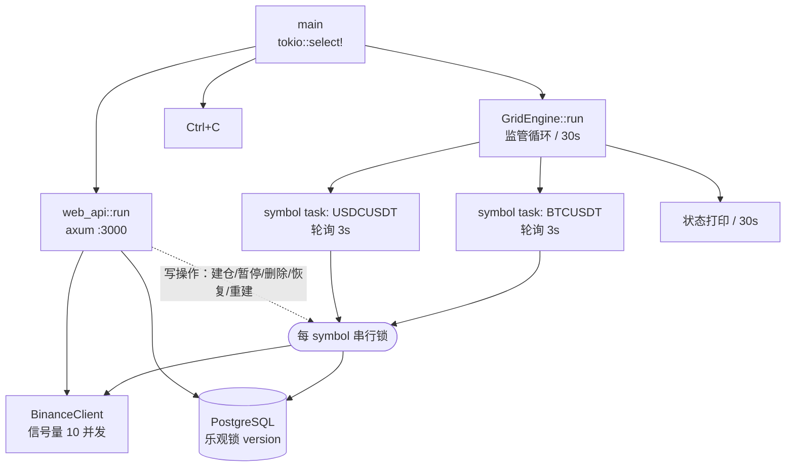
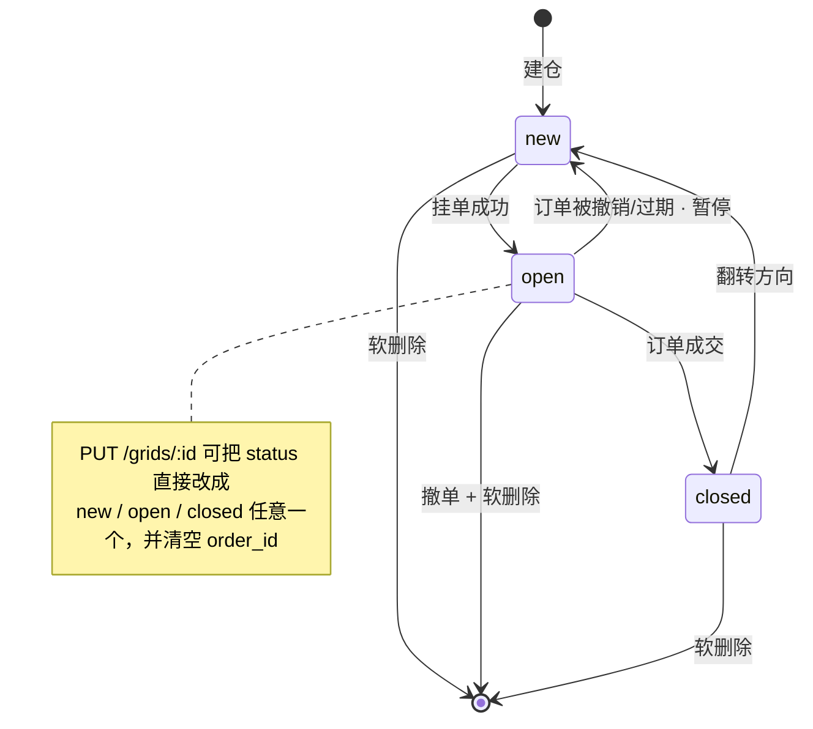

# rungs

[](LICENSE)
[](https://www.rust-lang.org/)
[](https://www.postgresql.org/)

**Binance 现货网格交易机器人 —— 仅供技术研究与学习交流。** Rust 后端 + Vue 3 前端，编译成单个二进制文件，前端静态资源由后端直接托管，部署时不需要 nginx 之外的任何东西。

> **使用前请先完整阅读[免责声明](#免责声明)。** 这是一个会用真实资金在真实交易所下单的程序，可能导致本金全部损失。

简体中文 | [English](README.en.md)

---

# 免责声明

> ⚠️ **本项目仅供技术研究与学习交流使用。**

## 这不是一个理财产品

rungs 是一个用来研究「网格策略如何工程化落地」的开源实现——它演示的是状态机、并发一致性、交易所 API 约束处理这些**工程问题**，而不是一套经过验证的盈利策略。

作者只在 **USDC/USD 这一个稳定币交易对**上做过小额试跑，期间录得约 **0.04% 的日收益**（单利年化约 15%）。请正确理解这个数字：

- **它来自稳定币对，不能外推到任何其他交易对。** USDC/USD 价格长期锚定在 1 附近，波动极小、格距极窄，与 BTCUSDT 这类波动性交易对是完全不同的场景——这个数字对后者没有任何参考价值。
- 它是**单一账户、单一交易对、有限时间窗口、特定行情下的一次观测**，不是回测，不具备任何统计意义。
- 「年化 15%」是把一小段顺风行情**线性外推**的结果。网格收益高度依赖波动率，以及价格是否始终留在区间内——样本之外这个外推立刻失效。

**过往表现不代表未来结果。本项目不构成任何投资、财务或交易建议。**

## 你可能损失的

- **市场风险**：加密货币价格波动剧烈，**可能导致本金全部损失**。网格策略在震荡区间内获利，在单边下跌行情中会持续买入不断贬值的资产，在单边上涨行情中会过早卖出并踏空。
- **技术风险**：软件缺陷、网络中断、交易所 API 变更或宕机、服务器故障、时钟漂移，都可能导致挂单丢失、重复下单或资金被长期锁定。本项目**没有经过任何第三方审计**。
- **自动化风险**：程序会在无人值守的情况下自动撤单和下单。尤其注意**自动重新居中会撤掉你在该交易对上的所有挂单，并按当前价重建整个网格**——请确认你理解[工作原理](#工作原理)中描述的每一个自动行为。
- **安全风险**：Web API 持有你交易所账户的下单、撤单、读余额的完整权限。配置不当等同于把账户交给公网，详见[安全模型](#安全模型)。

## 使用条款

- 本软件按「**原样**」提供，**不含任何形式的明示或默示担保**，包括但不限于适销性、特定用途适用性的担保（见 [LICENSE](LICENSE)）。
- **作者不对任何人因使用或无法使用本软件而产生的任何直接、间接、偶然或后果性损失承担责任**，包括但不限于资金损失、数据丢失和利润损失。
- **本项目不为商业用途设计。** 作者不建议、不支持、也不为任何商业运营或对外提供的托管服务承担责任。（法律层面的授权范围仍以 [AGPL-3.0](LICENSE) 为准——该许可证本身并不禁止商用，但作者在此明确表达不推荐的立场。）
- 使用本软件即表示你已阅读并理解上述全部内容，并**自行承担全部风险与后果**。
- 请自行确认在你所在的司法管辖区内，自动化加密货币交易是合法的。

## 如果你还是要跑

- Binance API Key **只勾选现货交易权限，绝不要勾选提现权限**，并绑定服务器 IP 白名单。
- **只投入你完全可以承受损失的金额。** 先用最小金额跑足够长的时间，覆盖至少一次行情切换。
- 服务默认只监听 `127.0.0.1`，**不要把它直接暴露到公网**。
- 定期人工核对交易所挂单与数据库记录是否一致。

---

## 目录

- [免责声明](#免责声明)
- [这是什么](#这是什么)
- [特性](#特性)
- [架构](#架构)
- [工作原理](#工作原理)
- [安全模型](#安全模型)
- [快速开始](#快速开始本地开发)
- [生产部署](#生产部署ubuntu)
- [配置项](#配置项)
- [API 接口](#api-接口)
- [数据库](#数据库)
- [运维](#运维)
- [已知限制](#已知限制)
- [License](#license)

---

## 这是什么

网格交易的思路很简单：在一个价格区间内布下若干「格子」，每格设一个买价和一个卖价。价格下跌时买入，上涨时卖出，反复吃震荡区间的差价。

rungs 把这套逻辑做成了一个常驻服务：

- **引擎**按交易对（symbol）并发轮询，维护每个格子的状态机，自动挂单、检测成交、翻转方向、重新挂反向单。
- **价格跑出网格区间**时会自动跟随——先尝试只滑动一格，实在跟不上就撤单重建整个网格。
- **Web 界面**用来建仓、监控、查收益，也可以手动干预（暂停某格、立即重建）。

单运营者设计：整个进程共用一套 Binance 密钥，注册接口只在数据库里一个账号都没有时开放。

**这个项目的价值在工程侧，不在策略侧。** 网格策略本身是公开常识，真正难的是把它做成一个不会在深夜悄悄搞砸的常驻服务——订单已在交易所生效但数据库写失败怎么办、两个调用方同时挂单怎么办、交易所限频和时钟漂移怎么办。代码里绝大多数注释都在解释这类决策。如果你是冲着「一个能赚钱的机器人」来的，请先读[免责声明](#免责声明)。

## 特性

| | |
|---|---|
| **金融精度** | 全程 `rust_decimal`，价格与数量计算中不存在 `f64` |
| **智能建仓** | 只填交易对、格数、间距三个参数，其余按账户余额自动分配 |
| **自动跟随行情** | 价格持续超出区间 5 分钟后，滑动窗口移格；无格可移时全量重建 |
| **稳定锚点** | 重建时以过去 24 小时 1H K 线收盘价**中位数**定位网格，而非瞬时价 |
| **交易所约束感知** | 自动读取并缓存 `stepSize` / `tickSize` / `minQty` / `minNotional`，取整后再下单 |
| **幂等下单** | `clientOrderId = g{格子ID}v{版本号}`，请求超时重试不会产生第二笔真实订单 |
| **并发安全** | 数据库乐观锁 + 每 symbol 串行锁，双重防止重复下单 |
| **不留孤儿订单** | 订单已挂出但数据库写入失败时，立即撤单；撤不掉就把 `order_id` 打进 error 日志 |
| **限频自节流** | 收到 429/418 后客户端主动进入等待窗口，不会把限频升级成 IP 封禁 |
| **时钟自校准** | 遇到 `-1021` 时间戳错误自动与交易所对时并重试 |
| **单二进制部署** | 前端打包产物由 axum 托管，含 SPA fallback |

## 架构

### Workspace 结构

```
crates/
├── app/            # 二进制入口，引擎与 Web API 并发运行
├── config/         # 配置加载（dotenvy + envy）
├── binance-client/ # Binance 现货 REST API：HMAC-SHA256 签名、限频自节流、时钟校准
├── db/             # sqlx 数据访问层（PostgreSQL）
├── grid-engine/    # 网格交易核心引擎 + 策略纯函数
└── web-api/        # axum HTTP API + 静态文件托管
frontend/           # Vue 3 管理后台，构建产物输出到 public/dist/
migrations/         # 数据库迁移，按文件名顺序执行
```

### 运行时拓扑



监管循环每 30 秒对账一次：新出现的 symbol 拉起 task，已无网格的 symbol 停掉 task，意外退出的 task 重启。数据库抖动不会终止引擎——查询失败时沿用上一轮的 symbol 集合继续跑。

## 工作原理

### 网格状态机

每个格子（`user_grid` 一行）在四个状态间流转：



- **new**：还没挂单。buy 格挂 `buy_price` 的限价买单，sell 格挂 `sell_price` 的限价卖单。
- **open**：单子在交易所挂着。每轮拉一次 `openOrders` 判断是否还在；不在了就单独查该订单状态，区分 `FILLED` 与 `CANCELED/EXPIRED`。
- **closed**：已成交。立刻翻转方向——买单成交后变成卖格，卖单成交后变成买格——并在**同一轮内**挂出反向单，不等下一次轮询。

**金额单位在翻转时会换算**，这是容易出错的地方：buy 格的 `amount` 是要花掉的计价币金额，sell 格的 `amount` 是要卖出的基础币数量。买单成交后实际买到 `round_quantity(amount / buy_price)` 个基础币，卖腿必须卖这个数量；沿用旧 `amount` 会让卖腿要求的基础币多于实际买到的，必然被交易所以 `-2010` 拒绝并卡死。

**利润只在卖单成交时入账**：卖出才是真正换回计价币、差价落袋。买单成交只是把计价币换成基础币，利润尚未实现。状态流转与利润入账在同一个数据库事务里完成，不会出现「已 closed 但利润没记上」。

### 智能建仓与余额分配

`POST /api/user/grids/auto-center` 只需三个参数：

| 参数 | 示例 | 说明 |
|------|------|------|
| `symbol` | `USDCUSDT` | 交易对 |
| `grid_count` | `4` | 格子总数（1–20） |
| `spacing` | `0.0001` | 相邻格子的价格间距 |

执行流程：撤销该 symbol 全部挂单 → 等待 2 秒让资金回到 `free` → 读取账户余额 → 按比例分配格数 → 计算锚点价 → 软删旧格 → 批量写入新格。

分配算法（`allocate_grids`，纯函数，有完整测试覆盖）：

```
# base 与 quote 是两种不同货币，必须先用当前价折算到同一单位
base_value  = base × price
total_value = base_value + quote

sell_grids = round(grid_count × base_value / total_value)
             两边都有余额时，各方向至少保留 1 格

# 每个卖格必须同时满足 minQty 与 minNotional，否则减少卖格数（每格分到更多）
while sell_grids > 0 and (base / sell_grids 不满足交易所约束):
    sell_grids -= 1

buy_grids   = grid_count − sell_grids
sell_amount = base  / sell_grids     # 每卖格投入，基础币计
buy_amount  = quote / buy_grids      # 每买格投入，计价币计
```

两个容易踩的坑，代码里都处理了：

1. **折算再比较。** 直接 `base + quote` 会把 0.5 BTC 和 45000 USDT 当成 "45000.5"，BTC 侧权重趋近于零，卖格永远分不到——一半资金就此闲置。
2. **dust 按名义价值判定。** 0.00002 BTC 和 5 USDT 都要按其 USDT 价值衡量，而不是拿同一个裸数字套在两种货币上。

### 价格跑出区间：滑动窗口与全量重建

每轮都检查当前价是否落在 `[min_buy, max_sell]` 之内。超出后开始计时，**持续超出满 300 秒**（`RANGE_DELAY_SECS`，编译期常量）才触发动作——短暂插针不会引发重建。计时期间每 10 分钟打印一次告警，价格回归立即清零计时器。

**滑动窗口**（优先）：只移动一格，格子总数不变。

- 价格突破上边界 → 撤掉 `buy_price` 最低的那个未成交买格，在顶部新建一个卖格
- 价格跌破下边界 → 撤掉 `sell_price` 最高的那个未成交卖格，在底部新建一个买格

这个操作不需要等资金结算：撤买单释放的是计价币，新卖单锁定的是基础币，两种资产不冲突。

**全量重新居中**（降级）：对应方向已无未成交格可移时执行。撤销全部挂单 → 等 2 秒 → 读 `free` 余额 → 按上面的算法重新分配 → 以新锚点重建所有格子。

锚点用的是**过去 24 根 1H K 线收盘价的中位数**，而不是当前价——瞬时价格容易被插针带偏，中位数稳定得多。K 线拉取失败时降级用当前价，不中断重建。最终 `p_floor = ceil(锚点 / spacing) × spacing`。

### 并发与一致性

三道防线叠加，因为任何一道单独都不够：

1. **数据库乐观锁**。`user_grid.version` 每次状态流转 +1，所有写操作都带 `WHERE version = $n`。冲突时跳过本轮，不报错。
2. **每 symbol 串行锁**。`process_symbol` 有两个并发调用方——引擎自己的轮询 task，和 HTTP 的 `resume_grids`。两者会读到 version 相同的快照、各自挂出一笔**真实订单**，而乐观锁只拦得住后写库的那一方——订单已经在交易所上了。这把 `tokio::Mutex` 保证同一 symbol 同时只有一轮在跑。
3. **幂等键**。`clientOrderId = g{grid_id}v{version}`。同键重复提交会被 Binance 拒绝，所以「请求超时但实际已下单」这类模糊结果重试时不会变成两笔单。

**订单与数据库的一致性**是这里最要命的部分。订单一旦被交易所接受就立即生效，但数据库还不知道它。代码保证「库里记不下这笔单」⇒「立刻把它从交易所撤掉」：乐观锁冲突撤单、写库失败撤单。如果连撤单都失败了，`order_id` 会被打进 **error 级日志**——那是这笔钱唯一的线索，必须能人工核对。

同理，撤单失败时**绝不继续软删除**持有 `order_id` 的数据库行，否则这笔真实挂单将永久失去追踪线索、资金一直被锁在交易所。只有 `-2011`（订单不存在）和 `-2013`（订单已终结）会被当作撤单成功吞掉。

### 交易所约束与限频

**下单约束**：首次访问某 symbol 时拉一次 `exchangeInfo` 并进程内缓存 `stepSize` / `tickSize` / `minQty` / `minNotional`。数量按 `stepSize` 向下取整（不能用 `floor()` 代替——那等价于假定 `stepSize == 1`，对 BTCUSDT 的 `0.00001` 步长会把任何小于 1 BTC 的量抹成 0），价格按 `tickSize` 取整，名义价值不足 `minNotional` 的订单在本地就被拦下，不浪费 API 权重。

**买单余额防护**：同一轮里的多个买格共享一份计价币预算，每挂出一笔就递减实际花费。否则每格都拿同一个初值判断「够不够」，从第 2 格起判断全部失真。单笔请求金额超过 `free` 余额时自动降额到 `free × 0.9995`（留 0.05% 缓冲防时序差异）。

**限频**：并发请求由信号量限制在 10 个。收到 `429`/`418` 后按 `Retry-After` 进入自我节流窗口，窗口内的所有出网请求先等待——3 秒一轮的轮询继续硬砸只会把封禁时长一路升级。

**时钟**：所有签名请求带 `recvWindow=5000`。宿主机时钟漂移超过 1 秒就会让签名请求被全部拒绝，而现象只是每格一条普通告警——交易实际已全面停摆。所以遇到 `-1021` 时自动拉取交易所时间、算出偏差、重试一次。

## 安全模型

**这个 API 持有你交易所账户的下单、撤单、余额读取权限。** 请把它当成金库门来对待。

| 措施 | 说明 |
|------|------|
| **默认只监听 127.0.0.1** | 由 `BIND_ADDR` 控制。设为其他地址时启动日志会打印告警。远程访问请走 nginx + TLS + 访问控制，或 SSH 隧道 |
| **注册接口一次性** | `POST /api/auth/register` 只在 `users` 表为空时开放，建立唯一运营账号后永久返回 403。此后新增账号须由运维直接操作数据库 |
| **启动期不变式校验** | 检测到超过 1 个用户持有网格时**拒绝启动**——引擎按 symbol 而非 user_id 调度，第二个账号的网格会动用运营者的资金 |
| **认证接口限流** | 按来源 IP，突发 5 次、之后约每 12 秒 1 次。既防密码爆破，也防 bcrypt（每次 200–400ms）把 blocking 线程池打满 |
| **登录时序恒定** | 用户名不存在时用一个固定的假哈希跑完整的 bcrypt 校验，两条路径耗时一致，无法通过响应时间枚举用户名 |
| **JWT 密钥强度** | 启动时强制校验 `JWT_SECRET` ≥ 32 字符（HMAC-SHA256 密钥短于签名输出时安全强度下降），token 有效期 7 天 |
| **密码哈希** | bcrypt，`DEFAULT_COST`，在 blocking 线程池执行 |
| **SQL 全参数化** | 统一 sqlx `$1, $2` 绑定，无字符串拼接 |
| **越权即 404** | 访问他人的网格 id 与访问不存在的 id 返回同一个状态码，不泄露资源是否存在 |
| **密钥不入库不入日志** | Binance 凭据只从环境变量读取；`.env` 在 `.gitignore` 中 |

**Binance API Key 权限：只勾选现货交易，绝不要勾提现。** 建议同时绑定服务器 IP 白名单。

## 快速开始（本地开发）

前置：Rust 1.88+、Node.js 20+、PostgreSQL 18。

```bash
git clone https://github.com/iciker/rungs.git
cd rungs
cp .env.example .env    # 填写真实值，见「配置项」
```

**先建库再编译。** 后端用 `sqlx::query!` 宏在编译期校验 SQL，需要能连上一个已建表的数据库：

```bash
createdb rungs
for f in migrations/*.sql; do psql "$DATABASE_URL" -f "$f"; done
```

然后跑起来：

```bash
cargo run                     # 后端 :3000

cd frontend && npm install    # 另开一个终端
npm run dev                   # 前端 :5173，/api 代理到 :3000
```

生产形态（前端打包后由 Rust 托管，只需访问一个端口）：

```bash
cd frontend && npm run build  # 输出到 public/dist/
cd .. && cargo run --release  # http://localhost:3000
```

首次访问 Web 界面时注册运营账号——这是注册接口唯一一次可用的机会。

## 生产部署（Ubuntu）

> 适用于 Ubuntu 22.04 / 24.04 LTS。

### 1. 系统依赖

```bash
sudo apt update && sudo apt upgrade -y
sudo apt install -y build-essential pkg-config libssl-dev curl git
```

### 2. Rust 工具链

```bash
curl --proto '=https' --tlsv1.2 -sSf https://sh.rustup.rs | sh
source ~/.cargo/env
rustc --version
```

### 3. Node.js 20（构建前端用）

```bash
curl -fsSL https://deb.nodesource.com/setup_20.x | sudo -E bash -
sudo apt install -y nodejs
node --version
```

### 4. PostgreSQL 18

```bash
sudo apt install -y postgresql-common
sudo /usr/share/postgresql-common/pgdg/apt.postgresql.org.sh -y
sudo apt install -y postgresql-18
sudo systemctl enable --now postgresql
```

### 5. 建库建用户

```bash
sudo -u postgres psql <<'EOF'
-- 重新部署时先清理旧库（全新部署跳过前三行）
SELECT pg_terminate_backend(pid) FROM pg_stat_activity WHERE datname = 'rungs';
DROP DATABASE IF EXISTS rungs;
DROP USER IF EXISTS rungs;

CREATE USER rungs WITH PASSWORD '你的数据库密码';
CREATE DATABASE rungs OWNER rungs;
GRANT ALL PRIVILEGES ON DATABASE rungs TO rungs;
EOF
```

### 6. 拉代码、配环境变量

```bash
sudo git clone https://github.com/iciker/rungs.git /opt/rungs
cd /opt/rungs
cp .env.example .env
nano .env
```

生成随机 JWT 密钥并加固文件权限：

```bash
openssl rand -hex 32
chmod 600 .env
```

### 7. 建表

按文件名顺序执行全部迁移：

```bash
set -a && source /opt/rungs/.env && set +a
for f in /opt/rungs/migrations/*.sql; do psql "$DATABASE_URL" -f "$f"; done
```

### 8. 构建

**顺序不能反**：后端编译期要连数据库校验 SQL，所以必须先完成上一步建表。

```bash
cd /opt/rungs/frontend && npm install && npm run build   # → /opt/rungs/public/dist/
cd /opt/rungs && cargo build --release                   # → target/release/rungs
```

首次编译约 5–10 分钟。

### 9. 系统服务用户

```bash
sudo useradd --system --no-create-home --shell /bin/false rungs-svc
sudo chown -R rungs-svc:rungs-svc /opt/rungs
sudo chmod 750 /opt/rungs
sudo chmod 600 /opt/rungs/.env
```

### 10. systemd

```bash
sudo nano /etc/systemd/system/rungs.service
```

```ini
[Unit]
Description=rungs — Binance Grid Trading Bot
After=network.target postgresql.service
Requires=postgresql.service

[Service]
Type=simple
User=rungs-svc
Group=rungs-svc
WorkingDirectory=/opt/rungs
EnvironmentFile=/opt/rungs/.env
ExecStart=/opt/rungs/target/release/rungs
Restart=on-failure
RestartSec=10
StandardOutput=journal
StandardError=journal
SyslogIdentifier=rungs

# 安全加固
NoNewPrivileges=true
PrivateTmp=true
ProtectSystem=strict
ReadWritePaths=/opt/rungs

[Install]
WantedBy=multi-user.target
```

```bash
sudo systemctl daemon-reload
sudo systemctl enable --now rungs
```

### 11. 验证

```bash
sudo systemctl status rungs
sudo journalctl -u rungs -f     # 看到「配置加载成功」「数据库连接成功」即正常

curl http://localhost:3000/api/auth/login \
  -H "Content-Type: application/json" \
  -d '{"username":"test","password":"test"}'
# 返回 HTTP 401 和 {"message":"用户名或密码错误"} 说明后端在正常响应
```

### 12. 防火墙

> ⚠️ **不要把 3000 端口暴露到公网。** 服务默认只监听 `127.0.0.1`，请始终经由 nginx + TLS + 访问控制对外提供，或只通过 SSH 隧道访问。

```bash
sudo ufw allow ssh
sudo ufw allow 443/tcp    # 只开 nginx 的 HTTPS
sudo ufw enable
```

### 13. nginx 反向代理 + HTTPS（可选）

```bash
sudo apt install -y nginx certbot python3-certbot-nginx
sudo nano /etc/nginx/sites-available/rungs
```

```nginx
server {
    listen 80;
    server_name your-domain.com;

    location / {
        proxy_pass http://127.0.0.1:3000;
        proxy_http_version 1.1;
        proxy_set_header Host $host;
        proxy_set_header X-Real-IP $remote_addr;
        proxy_set_header X-Forwarded-For $proxy_add_x_forwarded_for;
        proxy_set_header X-Forwarded-Proto $scheme;
    }
}
```

```bash
sudo ln -s /etc/nginx/sites-available/rungs /etc/nginx/sites-enabled/
sudo nginx -t && sudo systemctl reload nginx
sudo certbot --nginx -d your-domain.com
```

nginx 只做转发是不够的——它是唯一的对外入口，请在此加上 HTTP Basic Auth、客户端证书或 IP 白名单。

### 更新部署

```bash
cd /opt/rungs
sudo git pull
cd frontend && npm install && npm run build && cd ..
cargo build --release
sudo systemctl restart rungs
```

## 配置项

复制 `.env.example` 为 `.env` 后填写。**变量名由 `crates/config` 的 `AppConfig` 字段决定**（envy 自动转大写），不可改名。

| 变量 | 必填 | 默认 | 说明 |
|------|:---:|------|------|
| `BINANCE_APIKEY` | ✅ | — | Binance API Key。注意是 `APIKEY` 不是 `API_KEY` |
| `BINANCE_SECRET` | ✅ | — | Binance API Secret |
| `DATABASE_URL` | ✅ | — | 只认 `postgres://` 或 `postgresql://`，不支持 `+asyncpg` 之类的驱动后缀 |
| `JWT_SECRET` | ✅ | — | 最短 32 字符，启动时强制校验。生成：`openssl rand -hex 32` |
| `PORT` | | `3000` | Web API 端口。`frontend/vite.config.ts` 的开发代理指向此端口 |
| `BIND_ADDR` | | `127.0.0.1` | 监听地址。改成 `0.0.0.0` 会在启动日志打印告警 |
| `RUST_LOG` | | `info` | 日志级别，支持 `tracing` 的 env-filter 语法 |

编译期常量（改动需重新编译）：

| 常量 | 值 | 位置 |
|------|-----|------|
| `RANGE_DELAY_SECS` | 300 秒 | `crates/grid-engine/src/engine.rs` — 超出区间多久后触发跟随 |
| 轮询间隔 | 3 秒 | `crates/grid-engine/src/engine.rs` — 每 symbol 每轮间隔 |
| `SUPERVISE_INTERVAL` | 30 秒 | `crates/grid-engine/src/engine.rs` — 监管循环对账周期 |
| `CANCEL_ORDERS_SETTLE_SECS` | 2 秒 | `crates/binance-client/src/lib.rs` — 撤单后等资金回到 free |
| `RECV_WINDOW_MS` | 5000 | `crates/binance-client/src/lib.rs` — 签名请求容忍的时间偏差 |
| `TOKEN_TTL_SECS` | 7 天 | `crates/web-api/src/auth.rs` — JWT 有效期 |

## API 接口

成功时直接返回业务 JSON；失败时使用 HTTP 状态码并返回 `{ "message": "..." }`。

| 方法 | 路径 | 认证 | 说明 |
|------|------|------|------|
| POST | `/api/auth/register` | 无（**仅首次可用**） | 建立唯一运营账号；`users` 表非空后永久 403 |
| POST | `/api/auth/login` | 无 | 登录，返回 JWT |
| GET | `/api/user/grids` | Bearer | 网格列表，按 symbol 分组 |
| POST | `/api/user/grids` | Bearer | 手动创建单个网格 |
| PUT | `/api/user/grids/:id` | Bearer | 更新网格 |
| DELETE | `/api/user/grids/:id` | Bearer | 删除网格（软删除 + 撤单） |
| POST | `/api/user/grids/auto-center` | Bearer | 智能建仓 |
| POST | `/api/user/grids/pause` \| `/resume` | Bearer | 按 symbol 批量暂停 / 恢复 |
| POST | `/api/user/grids/:id/toggle-pause` | Bearer | 单格暂停 / 恢复 |
| GET | `/api/user/trades` | Bearer | 交易历史（最近 100 条） |
| GET | `/api/user/profit-stats` | Bearer | 收益统计 |
| GET | `/api/user/balance` | Bearer | Binance 现货余额 |
| GET | `/api/user/price/:symbol` | Bearer | 最新成交价 |
| GET | `/api/user/engine-status/:symbol` | Bearer | 该 symbol 是否超出网格区间、已超出多久 |
| POST | `/api/user/recenter/:symbol` | Bearer | 立即触发重新居中 |

`/api/auth/*` 有按来源 IP 的限流（突发 5 次，之后约每 12 秒 1 次）。其余路径由 `ServeDir("public/dist")` 处理，带 `index.html` fallback 以支持 Vue Router 的 history 模式。

创建网格的输入校验：`buy_price` 与 `sell_price` 必须为正、`buy_price < sell_price`、`amount > 0`、`side ∈ {buy, sell}`。`buy_price` 会作为除数参与数量换算，为零会让引擎除零并杀死该 symbol 的轮询 task，所以这一条卡得很死。

## 数据库

三张表，全部迁移执行后的结构：

**`users`** — 运营账号。`id`、`username`（唯一）、`password`（bcrypt 哈希）、`email`（唯一）、`created_at`。

**`user_grid`** — 网格档位，核心表。

| 列 | 类型 | 说明 |
|----|------|------|
| `amount` | `NUMERIC(36,8)` | buy 格：计价币花费额；sell 格：基础币数量 |
| `buy_price` / `sell_price` | `NUMERIC(36,8)` | 该格的买价与卖价 |
| `side` | `VARCHAR(10)` | `buy` / `sell`，成交后翻转 |
| `status` | `VARCHAR(20)` | `new` → `open` → `closed` → `deleted` |
| `is_paused` | `BOOLEAN` | 为真时引擎跳过该格，恢复后从原状态继续 |
| `source` | `VARCHAR(20)` | `manual` 手动创建 / `auto` 智能建仓 |
| `version` | `BIGINT` | 乐观锁版本号，每次状态流转 +1 |

**`trade_history`** — 已成交记录，`profit = (sell_price − buy_price) × amount`。只在卖单成交时写入。

**索引策略**：`user_grid` 上是两个**部分索引**，只收录仍在调度的行——软删除的行永不清理，表只增不减，全表扫描代价会随时间单调上升，而部分索引的体积只与「活跃网格数」成正比。

```sql
CREATE INDEX idx_user_grid_live ON user_grid (symbol)
    WHERE status <> 'deleted' AND is_paused = FALSE;      -- 引擎热路径，每 3 秒一轮
CREATE INDEX idx_user_grid_user_active ON user_grid (user_id, symbol)
    WHERE status <> 'deleted';                            -- GET /api/user/grids
CREATE INDEX idx_trade_user_filled ON trade_history (user_id, filled_at);
```

迁移 `20260814000002` 删掉了三个不承担任何查询的索引。每个索引都要在每次 `UPDATE` 时维护，而 `user_grid.status` 几乎每次状态流转都变——索引越多，单次成交的写放大越明显。

## 运维

```bash
sudo systemctl status rungs        # 服务状态
sudo journalctl -u rungs -f        # 实时日志
sudo journalctl -u rungs -n 100    # 最近 100 行
sudo systemctl restart rungs       # 重启
```

应用日志同时按天滚动写入文件：

```bash
tail -f /opt/rungs/logs/app.log.$(date +%Y-%m-%d)
```

引擎每 30 秒打印一次全部网格的状态快照，包含 `grid_id`、`symbol`、`side`、`status`、买卖价、`order_id`——排查「某格为什么不动」时先看这个。

值得设告警的日志：

| 关键字 | 含义 |
|--------|------|
| `撤销失败：交易所存在一笔数据库未记录的活单` | **需要人工核对**。日志里的 `order_id` 是这笔资金唯一的线索 |
| `撤单失败且订单可能仍然存活` | 重建/滑窗被主动中止，挂单仍在交易所 |
| `价格超出网格范围，等待滑动窗口触发` | 每 10 分钟一次，价格已跑出区间 |
| `触发交易所限频，客户端进入自我节流` | 429/418，检查是否有其他程序共用同一密钥 |
| `已按交易所时间校准本地时钟偏差` | 宿主机时钟漂移，建议装 `chrony` |
| `轮询 task 已意外退出，正在重启` | 该 symbol 的 task panic 过 |

## 已知限制

- **只支持现货**，不涉及杠杆或合约。
- **单运营者**：全进程共用一套 Binance 密钥，引擎按 symbol 而非 user_id 调度。多账号需要重新设计调度层。
- **轮询而非 WebSocket**：3 秒一轮 REST 拉取，成交检测最坏延迟 3 秒。交易对多时注意 API 权重。
- **关键阈值是编译期常量**：改 `RANGE_DELAY_SECS`、轮询间隔等需要重新编译。
- **软删除的行不清理**：`user_grid` 只增不减。长期运行后建议定期归档 `status = 'deleted'` 的历史行。
- **无回测功能**：策略参数只能实盘小额试。

## License

[AGPL-3.0](LICENSE)。

本软件不含任何形式的担保。使用它进行交易的一切后果由你自己承担。
